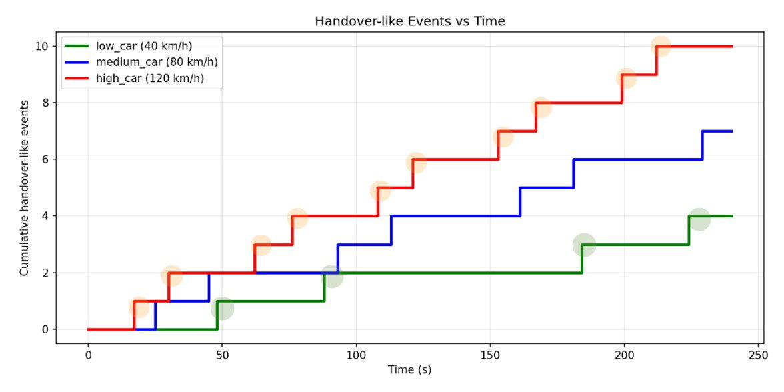
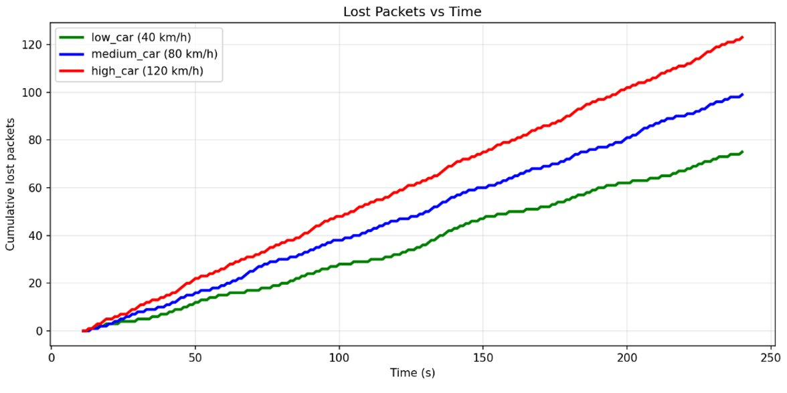

# Impact of Vehicle Speed on Handover and Packet Loss

### How fast can a car drive before its connection to the road starts to fall apart?


> **TL;DR** — We built a simplified **Vehicle-to-Infrastructure (V2I)** experiment in **SUMO + Python** and drove three cars down the same highway at **40, 80, and 120 km/h**. We then measured two things over time: how often each car had to *switch* its roadside connection (**handover-like events**) and how many of its packets *never arrived* (**packet loss**). The result is consistent and intuitive: **the faster the car, the worse the connection** — more handovers and more lost packets at every point in time. This repository documents the problem, the method, the evidence, and the reasoning, and compares the trends against five prior studies.

---

## ▶ Demo Video

The mandatory simulation demo shows the three vehicles moving along the RSU field and switching their connections in real time.

> **🎬 SUMO simulation demo:** **https://youtu.be/P6fjYpU_X28**
>
> **🎥 Full presentation video:** **https://youtu.be/XK4XutrjTkk**

---

## Table of Contents

1. [The Problem](#1-the-problem)
2. [Background: Key Concepts](#2-background-key-concepts)
3. [The Approach (Solution)](#3-the-approach-solution)
4. [Results](#4-results)
5. [Logical Deductions & Discussion](#5-logical-deductions--discussion)
6. [Trade-offs](#6-trade-offs)
7. [Validation Against Prior Work](#7-validation-against-prior-work)
8. [Limitations](#8-limitations)
9. [Conclusion](#9-conclusion)
10. [Repository Structure](#10-repository-structure)
11. [How to Reproduce](#11-how-to-reproduce)
12. [Team](#12-team)
13. [References](#13-references)

---

## 1. The Problem

Autonomous and connected vehicles do not drive in isolation. They constantly exchange data with **roadside units (RSUs)** and base stations along the road — receiving traffic signals, hazard alerts, lane guidance, and other safety-critical information. This is **V2I communication**, and on a highway it has an uncomfortable property: **the faster a vehicle moves, the less time it spends inside any single RSU's coverage area.**

That leads directly to the research question this project sets out to answer:

> ### How stable is V2I communication in a high-speed mobility environment?

The intuition we wanted to test is simple to state and easy to overlook:

> *Faster vehicles switch RSU connections more often, and that frequent switching can make communication quality less stable.*

Why this matters:

- **V2I is becoming safety-critical.** Connected cars exchange large volumes of data with infrastructure; if that link degrades, driving safety and comfort degrade with it. Reliable connectivity under mobility is a recognized open challenge in cellular V2X [2].
- **RSU coverage is finite.** A vehicle is only ever well-served by the *nearest* RSU. Higher speed shortens the time spent near each one.
- **Switching is not free.** Every connection change ("handover") is a moment of instability where packets can be delayed or dropped.

To make this measurable, we reduced the question to **two observable metrics**:

| Metric | Definition in this project |
| --- | --- |
| **Handover-like events** | Recorded every time a vehicle's *nearest connected RSU* changes. |
| **Packet loss** | Estimated with a simplified probability model that grows with **distance to the serving RSU** and with **vehicle speed**. |

---

## 2. Background: Key Concepts

**V2X (Vehicle-to-Everything)** is the umbrella term for a vehicle communicating with its surroundings. It includes:

- **V2V** — Vehicle-to-Vehicle (cars sharing speed, position, braking).
- **V2P** — Vehicle-to-Pedestrian (detecting people near the road).
- **V2N** — Vehicle-to-Network (cloud services, traffic information).
- **V2I** — Vehicle-to-Infrastructure (the focus of this project): vehicles exchanging data with roadside RSUs and base stations.

**Handover** is the process by which a moving vehicle changes its connection from one RSU to another. As a car drives, the signal from the RSU ahead eventually becomes stronger than the one behind it, and the connection switches. On a highway with multiple RSUs, this happens repeatedly. *In this project, a handover-like event is logged whenever the nearest connected RSU changes.*

**Packet loss** is the failure of transmitted data packets to reach their destination. If 100 packets are sent and 20 do not arrive, packet loss = 20. In wireless links, loss rises with longer distance, weaker signal, and faster movement — so high-speed vehicles tend to lose more packets than slow ones.

---

## 3. The Approach (Solution)

> **Important framing:** This project **does not implement an actual LTE/5G protocol.** It is a *simplified* simulation built on vehicle-movement data. The goal is to observe the **trend** — how changing speed changes handover frequency and packet loss — not to reproduce exact cellular performance.

### Tools

| Tool | Role |
| --- | --- |
| **SUMO** (Simulation of Urban Mobility) | Build a highway-like road, place vehicles, and run them at controlled speeds. |
| **Python** | Read SUMO's position/speed output, compute vehicle–RSU distances, decide the connected RSU, count handovers, and estimate packet loss. |

### Simulation environment

| Item | Setting |
| --- | --- |
| Road type | Highway-like, straight road |
| Number of RSUs | **3** (fixed positions along the road) |
| Number of vehicles | **3** (one per speed condition) |
| Speed conditions | 🟢 **40 km/h** (low) · 🔵 **80 km/h** (medium) · 🔴 **120 km/h** (high) |
| Connection rule | Each vehicle connects to the **nearest** RSU |
| Recording rule | A handover-like event is logged when the connected RSU **changes** |
| Packet sending rule | Each vehicle sends **1 packet per second** |
| Packet loss model | Simplified probability that **increases with distance** and **increases with speed** |

Running all three speeds on the **same road, same RSUs, same rules** isolates a single variable — **speed** — so any difference in the results can be attributed to it.

### Method (the analysis pipeline)

1. Construct the highway-like road in SUMO.
2. Run vehicles at 40, 80, and 120 km/h.
3. Export per-timestep vehicle **position** and **speed**.
4. For every timestep, compute the **distance** from each vehicle to each RSU.
5. Set the **connected RSU = nearest RSU**.
6. **Log a handover** whenever that nearest RSU changes from the previous step.
7. For each transmitted packet, draw a **loss** outcome from the distance-and-speed probability model and accumulate the count.

In pseudocode:

```text
for each timestep t:
    for each vehicle v:
        nearest = argmin_RSU( distance(v, RSU) )
        if nearest != previous_RSU[v]:
            handover_count[v] += 1          # connection switched
        previous_RSU[v] = nearest

        if t is a packet-sending tick:       # once per second
            p_loss = f( distance(v, nearest), speed(v) )   # ↑ with both
            if random() < p_loss:
                lost_packets[v] += 1
```

This deliberately isolates the effect of speed in a simplified V2I setting; it does **not** model full LTE/5G handover procedures or a real radio channel (see [Limitations](#8-limitations)).

---

## 4. Results

Two cumulative-over-time graphs tell the whole story. In both, the **x-axis is simulation time (s)** and the curves are ordered the same way: **🔴 high > 🔵 medium > 🟢 low** at essentially every point in time.

### 4.1 Handover-like Events vs. Time



Each upward step is one connection switch. The faster the car, the more frequent the steps, and the higher its curve sits above the others.

| Speed condition | Vehicle speed | Approx. final handover-like events |
| --- | ---: | ---: |
| 🟢 Low | 40 km/h | ~4 |
| 🔵 Medium | 80 km/h | ~7 |
| 🔴 High | 120 km/h | ~10 |

**Reading the graph:** the high-speed car reaches a given number of handovers far earlier than the others and finishes with roughly **2.5× the handovers of the low-speed car**. The curves never cross — the ordering by speed is stable across the entire run.

> **Higher Speed → Shorter RSU Dwell Time → More Frequent Connection Switching**

### 4.2 Lost Packets vs. Time



Loss accumulates roughly linearly for each car, with the slope ordered by speed.

| Speed condition | Vehicle speed | Final cumulative packet loss |
| --- | ---: | ---: |
| 🟢 Low | 40 km/h | ~75 |
| 🔵 Medium | 80 km/h | ~99 |
| 🔴 High | 120 km/h | ~123 |

**Reading the graph:** the gap between the lines *widens* over time, which is the signature of three different (and stable) average loss rates rather than a one-time penalty. By the end of the run the high-speed car has lost about **1.6× as many packets as the low-speed car**.

> **Higher Speed → Lower Connection Stability → More Packet Loss**

---

## 5. Logical Deductions & Discussion

This section makes the reasoning explicit — moving from *what the graphs show* to *why*.

**Deduction 1 — Dwell time is the mechanism.**
A vehicle at 120 km/h covers ground **3× faster** than one at 40 km/h. For a fixed RSU spacing, it therefore spends roughly **one-third the time** inside each coverage zone. Shorter dwell time means the "nearest RSU" boundary is reached sooner and crossed more often → more handovers per unit time. This is exactly the ordering observed: high > medium > low at every timestamp.

**Deduction 2 — The effect is monotonic but *sub-linear* in speed.**
Speeds scale 1 : 2 : 3 (40 : 80 : 120), yet final handovers scale roughly 4 : 7 : 10 ≈ **1 : 1.75 : 2.5**, and final packet loss scales 75 : 99 : 123 ≈ **1 : 1.32 : 1.64**. Both grow with speed but *slower* than speed itself. A plausible reason in this simplified setup: with only **three fixed RSUs**, the number of distinct boundary crossings available per traversal is bounded by geometry, so doubling speed does not double the count — it mainly increases how frequently those bounded events recur within the fixed time window.

**Deduction 3 — Constant send rate + linear loss curves ⇒ a constant average loss rate.**
Because each vehicle transmits at a fixed **1 packet/s** and the cumulative-loss curves are close to straight lines, the **slope** of each line approximates a constant average loss rate. Over the ~240 s run those slopes work out to roughly **0.3 / 0.4 / 0.5 lost packets per second** for the low / medium / high cars (≈75, 99, 123 total). Speed inflates the loss rate, but moderately — consistent with a model where *distance to the serving RSU* is the dominant term and speed adds a secondary penalty.

**Deduction 4 — The two metrics are two views of the same cause.**
More handovers means more time spent near coverage edges and mid-switch, where the distance to the serving RSU is largest and loss probability is highest. So the handover ranking and the loss ranking **coincide** (both high > medium > low) — not by accident, but because both are downstream of the same root cause: **reduced RSU dwell time at higher speed.**

**Bottom line:** within this simplified model, speed degrades V2I communication along a clear causal chain — *faster travel → shorter dwell time → more frequent switching and larger average distance → more handovers and more lost packets.*

---

## 6. Trade-offs

The central tension this project surfaces is between **mobility efficiency** and **communication stability**:

- **Higher speed is good for mobility** — vehicles reach their destinations faster and roads carry more traffic.
- **Higher speed is bad for the link** — shorter RSU dwell time, more frequent handovers, and more packet loss.

These two goals pull in opposite directions, so a high-speed V2I network cannot optimize for one without paying in the other. A real deployment must therefore *engineer around* the trade-off rather than eliminate it — for example through **denser RSU placement** (shorter gaps to cross), **predictive/make-before-break handover** (switch before the old link fails), or **redundancy and retransmission** (tolerate loss instead of preventing it). The design target is to keep delivery reliable *even for vehicles that pass through coverage areas quickly.*

---

## 7. Validation Against Prior Work

To check whether our simplified trends point in the same direction as published research, we compared them against five studies. **Our results are consistent with all five.**

| # | Reference | What it actually studies | How it relates to our trends |
| --- | --- | --- | --- |
| [3] | Gonzalez-Martín et al., *IEEE TVT*, 2019 | Analytical models of C-V2X Mode 4 PDR as a function of transmitter–receiver distance | PDR falls as distance grows — the basis for our distance-driven packet-loss model. |
| [4] | Osifeko et al., *JASEM*, 2018 | Effect of UE mobility speed on three LTE handover algorithms (handover count, SINR) | Higher speed → more completed handovers (matches §4.1). |
| [5] | Noori et al., *Kalahari J.*, 2022 | AODV in VANET at 60 & 80 km/h (PDR, end-to-end delay, overhead) | PDR drops and packet loss rises at higher speed (closest match to §4.2). |
| [6] | Alasmary & Zhuang, *Ad Hoc Networks*, 2012 | Impact of vehicle mobility on IEEE 802.11p MAC performance | Mobility degrades communication quality. |
| [7] | Tahir et al., *Sensors*, 2022 | Real-road LTE vs. 5G field test (V2V/V2I): throughput, packet loss, latency | Distance and link technology affect real V2X communication performance. |

These papers are used as **directional comparison points**, not as ground truth our simulation replicates. The takeaway is qualitative: even a simplified distance-and-speed model reproduces the same trend direction that more rigorous studies report. *(PDR = packet delivery ratio.)*

> **Note:** every paper above was verified against its source PDF and is cited in full in §13.

---

## 8. Limitations

This is a **trend analysis**, not a performance prediction. Two simplifications matter most:

1. **No real handover protocol.** We log a handover whenever the nearest RSU changes. Real LTE/5G handover is far richer, involving **RSRP** (Reference Signal Received Power), **SINR** (Signal-to-Interference-plus-Noise Ratio), **handover trigger conditions**, **time-to-trigger**, and base-station interfaces such as **X2 / NG**, all specified by the 3GPP NR standard [1].
2. **No real wireless channel.** Packet loss comes from a simplified distance-and-speed probability model. Real loss is also shaped by radio interference, obstacles, terrain, channel conditions, weather, and surrounding traffic density.

Because of these, the numbers should be read as **direction and ordering**, not as values that would appear on a real road.

---

## 9. Conclusion

Using a simplified SUMO + Python V2I environment, we showed that **higher vehicle speed reduces communication stability**:

- **Higher speed → more handover-like events** (~4 → ~7 → ~10).
- **Higher speed → more packet loss** (~75 → ~99 → ~123).

Both effects follow the same causal chain — faster travel shortens RSU dwell time, which forces more frequent switching and pushes the vehicle further from its serving RSU on average. The trends match five prior studies in direction. While we did not implement real LTE/5G protocols, the experiment makes a clear point: **as vehicles get faster, keeping V2I communication reliable becomes harder — and designing for that is essential** for safe connected and autonomous driving.

---

## 10. Repository Structure

```text
.
├── README.md                          # This tech-blog write-up
├── CN_Group11.pdf                     # Presentation slides
└── graphs/
    ├── handover-like_events.png       # Handover-like Events vs. Time
    └── packet_loss.png                # Lost Packets vs. Time
```

---

## 11. How to Reproduce

The analysis follows the pipeline in [§3](#3-the-approach-solution). To reproduce it end-to-end you would:

1. **Install SUMO** and Python 3 with `numpy`/`matplotlib`.
2. **Define the scenario** — a straight highway edge, three RSUs at fixed coordinates, and three vehicles assigned 40 / 80 / 120 km/h.
3. **Run SUMO** and export per-timestep vehicle position and speed (e.g. via TraCI or an FCD output file).
4. **Run the analysis** — for each timestep, compute vehicle–RSU distances, set the connected RSU to the nearest one, increment a handover counter on every change, and draw packet-loss outcomes from the distance-and-speed model.
5. **Plot** cumulative handovers and cumulative lost packets against time to regenerate the two graphs in `graphs/`.

---

## 12. Team

**Group 11 — Sejong Campus of Korea University**

| Member | Student ID | Role |
| --- | --- | --- |
| 👤 **Lee Seok Hyeon** | **2022270657** | **Research of relevant materials; preparation of the final report** *(owner of this repository)* |
| Ahn Jin Hwan | 2024270679 | Research of relevant materials; preparation of the final report |
| Im Hyo Jin | 2023380535 | Development and execution of SUMO; creation of the presentation |
| Lee Do Hyung | 2022270617 | Development and execution of SUMO; creation of the presentation |

---

## 13. References

[1] 3GPP, "NR and NG-RAN Overall Description; Stage 2 (Release 17)," *3GPP TS 38.300*, version 17.0.0, 2022.

[2] S. Gyawali, S. Xu, Y. Qian, and R. Q. Hu, "Challenges and Solutions for Cellular Based V2X Communications," *IEEE Communications Surveys & Tutorials*, vol. 23, no. 1, pp. 222–255, 2021, doi:10.1109/COMST.2020.3029723.

[3] M. Gonzalez-Martín, M. Sepulcre, R. Molina-Masegosa, and J. Gozalvez, "Analytical Models of the Performance of C-V2X Mode 4 Vehicular Communications," *IEEE Transactions on Vehicular Technology*, vol. 68, no. 2, pp. 1155–1166, 2019, doi:10.1109/TVT.2018.2888704.

[4] M. O. Osifeko, A. A. Okubanjo, O. R. Abolade, O. K. Oyetola, A. O. Oyedeji, and O. I. Sanusi, "Evaluating the Effect of Mobility Speed on the Performance of Three Handover Algorithms in LTE Networks," *Journal of Applied Sciences and Environmental Management*, vol. 22, no. 4, pp. 503–506, 2018, doi:10.4314/jasem.v22i4.11.

[5] M. S. Noori, O. A. Qasim, and E. A. Mohammed, "Effect of Speed on the Performance of VANET Routing Protocol," *International Journal of Mechanical Engineering*, vol. 7, no. 1, pp. 1829–1834, 2022.

[6] W. Alasmary and W. Zhuang, "Mobility Impact in IEEE 802.11p Infrastructureless Vehicular Networks," *Ad Hoc Networks*, vol. 10, no. 2, pp. 222–230, 2012, doi:10.1016/j.adhoc.2010.06.006.

[7] M. N. Tahir, P. Leviäkangas, and M. Katz, "Connected Vehicles: V2V and V2I Road Weather and Traffic Communication Using Cellular Technologies," *Sensors*, vol. 22, no. 3, art. 1142, 2022, doi:10.3390/s22031142.
